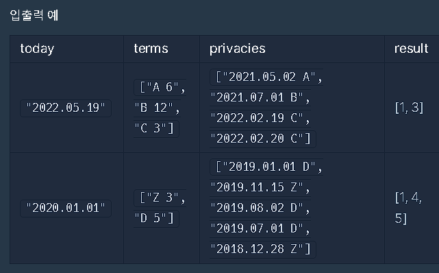

### 제출시 17번이 통과되지 않아서 추가로 확인한 테스트 케이스:
```
"2009.12.28" ["A 13"] ["2008.11.03 A"]
기댓값: [1]
```

개인정보 수집한 날짜가 주어진다. 개인정보 기간이(약정이) 달 수로 주어진다. 해당 달은 28일까지 있음을 간주해야 한다. 파기하는 순번을 오름차순으로 정렬 후 출력해야 한다. 

1. 날짜 형식 변환 ```int privacyDate = convertToDate(date_str);```
2. 수집 날짜로부터 약정 달 수만큼 더해 파기 가능한지 확인한다. ```int expirationDate = addMonths(privacyDate, term_map[term_type]);```
3. ```expirationDate``` 와 오늘 날짜를 비교하여 파기 가능한 개인정보를 배열에 순차적으로 1부터 출력한다. 

1. **`convertToDate(const string& date)`**:  
   - 이 함수는 날짜를 `"YYYY.MM.DD"` 형식의 문자열로 받아서, 이를 `YYYYMMDD` 형식의 정수로 변환.
   - 예를 들어, `"2023.05.21"`은 `20230521`로 변환.
   - `stringstream`을 사용해 날짜를 `year`, `month`, `day`로 나눈 뒤, 이를 정수 형태로 계산하여 하나의 정수로 반환.

2. **`addMonths(int date, int months)`**:  
   - 이 함수는 주어진 날짜에 지정된 개수의 월(month)을 더한 날짜를 계산.
   - 날짜는 `YYYYMMDD` 형식의 정수로 주어지며, 이 날짜에서 `months` 만큼 월을 더함.
   - 만약 월이 12를 초과하면, 12월을 넘어선 만큼 연도를 증가.
   - 결과적으로 유효기간이 지난 후의 날짜를 `YYYYMMDD` 형식으로 반환.

### `solution` 함수

1. **`map<char, int> term_map`**:  
   - `terms` 벡터에서 약관 유형과 그에 해당하는 유효기간(개월 수)을 `map` 자료구조에 저장.
   - 예를 들어, `"A 12"`라는 약관이 주어지면, `term_map['A'] = 12`로 저장.

2. **`todayDate = convertToDate(today)`**:  
   - 주어진 `today` 문자열을 `YYYYMMDD` 형식의 정수로 변환하여 `todayDate`에 저장.

3. **`for (int i = 0; i < privacies.size(); i++)`**:  
   - 각 개인정보 항목(`privacies`)에 대해 만료일을 계산하고 비교.
   - 각 개인정보 항목은 `YYYY.MM.DD` 형식의 날짜와 약관 유형이 포함된 문자열.
   - `date_str`을 이용해 개인정보의 날짜를 `YYYYMMDD` 형식으로 변환하고, 약관 유형(`term_type`)에 맞는 유효기간을 `term_map`에서 가져와서 만료일을 계산.

4. **만료 여부 검사**:  
   - 계산된 만료일(`expirationDate`)이 현재 날짜(`todayDate`)보다 작거나 같으면 해당 개인정보는 만료된 것이므로, 그 번호를 `answer` 벡터에 추가.

5. **`return answer`**:  
   - 만료된 개인정보 항목들의 번호가 들어있는 `answer` 벡터를 반환.

  
  

