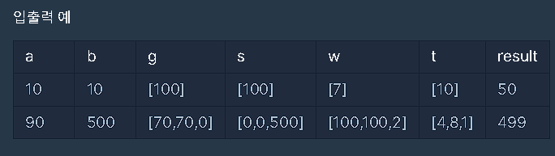
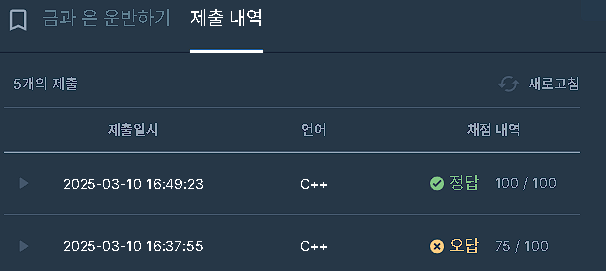

다시 한번 조건을 정리해보자:
a: 필요한 금의 무게
b: 필요한 은의 무게
새로운 도시의 수= 배열 요소의 개수
g: 배열당 운반 가능한 금의 무게
s: 배열당 운반 가능한 은의 무게
w: 최대 운반 가능한 무게
t: 각각의 도시마다 편도로 운반 가능한 시간
이 정보들을 토대로 a kg의 금, b kg의 은을 운반하는 최적의 시간을 result로 반환해야 한다.

이 조건들 아래에서는 운반 트럭이 왕복 그 이상의 거리를 운행해야 한다.
조건 1: 금의 무게 g가 최대 무게 w를 넘길 때?
조건 2: 은의 무게 s가 최대 무게 w를 넘길 때?
조건 3: 광물 각각은 편도로 옮길 수 있으나, 금 + 은의 (g+s) 무게가 최대 무게 w를 넘길 때?
이때에 한하여, t는 추가로 계산해야 한다는 뜻이다.

그리고 해당 t는 각 도시마다 걸리는 편도의 시간이기에, 모든 주어진 도시 (배열 요소당) t를 구해서 합해줘야 최적의 운반 시간을 구할 수 있다.

해당 문제는 [이진 탐색을(Binary Search)](https://velog.io/@junsj119/%EC%9D%B4%EC%A7%84%ED%83%90%EC%83%89Binary-Search) 적용해야 최적값을 구하기 쉽다.

최소값 0을 ```left```, 제한 사항 중 가장 큰 값인 1e9(10^9) 보다 높은 임의의 숫자를 ```right```로 놓고 풀자. 참고로 이 문제의 최종 값은 매우 크므로 long long 자료형 변환을 잊지말자.

추가로 사용한 변수는 이진 탐색의 진행에 따라 합산해야 하는 값들이다.
현재 총 금의 무게 g의 합 ```totalGold```, 현재 총 은의 무게 s의 합```totalSilver```, 현재 모든 광물의 무게 w의 합 ```totalWeight```, 현재 운반에 걸린 편도 횟수```trips```,모든 편도 횟수 trips로 계산된 무게 w들의 현재 합 ```maxTransport```

```
// 탐색 시작
while (left <= right) {
        long long mid = (left + right) / 2; //반으로 탐색 조건 줄이기
        long long totalGold = 0, totalSilver = 0, totalWeight = 0;

        for (int i = 0; i < g.size(); i++) {
            long long trips = mid / (2 * t[i]);  // 왕복 가능 횟수
            if (mid % (2 * t[i]) >= t[i]) trips++;  // 편도 운반 가능하면 추가

            long long maxTransport = trips * w[i]; // 이 도시의 최대 운반량
            totalGold += min((long long)g[i], maxTransport);  // long long로 타입 맞추기
            totalSilver += min((long long)s[i], maxTransport);  // long long로 타입 맞추기
            totalWeight += min((long long)(g[i] + s[i]), maxTransport);  // long long로 타입 맞추기
        }

        if (totalGold >= a && totalSilver >= b && totalWeight >= a + b) {
            answer = mid;
            right = mid - 1;
        } else {
            left = mid + 1;
        }
    }
```



문제의 조건을 잘못 이해하고, 최대 가능 시간을 주어진 가장 큰 값이었던 1e9의 시간을 right로 설정해서 오답이 발생했었다. 1e15로 테스트해보니 모든 케이스를 통과했다.
