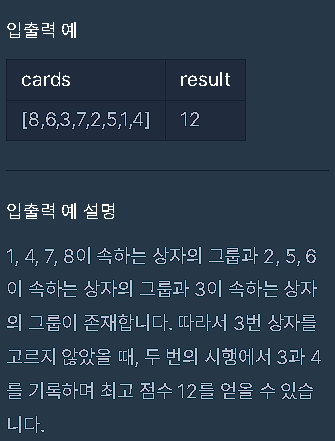
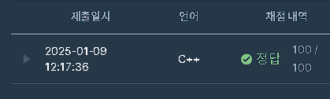

1. 각 카드 상자의 그룹을 찾고, 그룹 크기를 계산.
2. 그룹 크기들을 내림차순으로 정렬.
3. 가장 큰 두 그룹의 크기를 곱하여 최고 점수를 계산하고 반환.

백터 변수 초기화
```
int n = cards.size();  // cards 벡터의 크기(상자 수) 구하기
vector<bool> visited(n, false); // 각 상자의 방문 여부를 저장하는 벡터, 초기값은 false
vector<int> group_sizes; // 각 그룹의 크기를 저장하는 벡터

```

정렬 후 계산이 필요하므로, 버블정렬 사용.
```
for (int i = 0; i < n; ++i) {
    if (!visited[i]) {  // 아직 방문하지 않은 상자에 대해서만 그룹을 형성
        int count = 0;  // 현재 그룹의 크기
        int current = i;  // 현재 탐색 중인 상자
        while (!visited[current]) {  // 상자가 아직 방문되지 않았다면
            visited[current] = true;  // 상자 방문 처리
            current = cards[current] - 1;  // 카드에 적힌 숫자에 해당하는 상자 방문 (0-based 인덱스로 변경)
            ++count;  // 그룹 크기 증가
        }
        group_sizes.push_back(count);  // 계산된 그룹 크기 추가
    }
}

```

이후 내림차순으로 정렬. C++ algorithm 내장함수 ```std::sort```을 사용한다.
```sort(group_sizes.begin(), group_sizes.end(), greater<int>());```

마지막으로 가장 큰 그룹의 크기를 서로 곱한다
```
if (group_sizes.size() < 2) return 0; // 그룹이 2개 미만이면 점수를 얻을 수 없음
int answer = group_sizes[0] * group_sizes[1]; // 가장 큰 두 그룹의 크기를 곱함
return answer;
```



